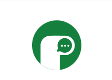

# Periskope

Periskope is a sleek, real-time chat app built with Next.js, React, and Supabase. It offers instant messaging, contact management, and a responsive design for both desktop and mobile.



## Features

- Real-time messaging with instant delivery  
- Secure authentication via Supabase Auth  
- Add, search, and filter contacts effortlessly  
- Message status tracking: sent, delivered, read  
- Responsive UI for all device sizes  
- Search existing contacts with debounced filtering  
- Add new contacts by user search  
- Scrollable conversation history  
- Filter conversations by unread messages  

## Tech Stack

- **Frontend**: Next.js 15, React 19, TailwindCSS 4, React Icons  
- **Backend**: Supabase (PostgreSQL, RLS)  
- **Auth**: Supabase Auth with middleware for protected routes  

## Project Structure

```
periskope/
├── app/                # Next.js app directory
│   ├── auth/           # Authentication pages
│   ├── chats/          # Chat interface pages
│   ├── layout.tsx      # Root layout component
│   └── page.tsx        # Home page component
├── components/         # Reusable React components
│   ├── auth/           # Authentication components
│   ├── chat/           # Chat interface components
│   └── ...             # Other UI components
├── public/             # Static assets
├── utils/              # Utility functions and services
├── types/              # TypeScript type definitions
├── middleware.ts       # Next.js middleware for auth
├── supabase-schema.sql # Database schema
└── ...                 # Configuration files
```


## Getting Started

### Prerequisites

- Node.js v18+  
- npm or yarn  
- Supabase account  

### Setup

1. Clone the repo:  
```bash
git clone https://github.com/yourusername/periskope.git
cd periskope


2. **Install dependencies**

```bash
npm install
# or
yarn install
```

3. **Set up environment variables**

Create a `.env.local` file in the root directory with the following variables:

```
NEXT_PUBLIC_SUPABASE_URL=your_supabase_url
NEXT_PUBLIC_SUPABASE_ANON_KEY=your_supabase_anon_key
```

4. **Set up Supabase**

- Create a new Supabase project
- Run the SQL from `supabase-schema.sql` in the SQL editor to set up the database schema
- Set up authentication providers in the Supabase dashboard

5. **Run the development server**

```bash
npm run dev
# or
yarn dev
```

Open [http://localhost:3000](http://localhost:3000) with your browser to see the application.

## Deployment

The application can be deployed on [Vercel](https://vercel.com/) or any other Next.js-compatible hosting service.

```bash
npm run build
# or
yarn build
```

## Database Structure

The application uses the following main tables:
- `profiles`: User profiles with username and avatar information
- `messages`: Chat messages between users with status tracking
- `contacts`: User-to-user connections

## License

This project is licensed under the MIT License - see the LICENSE file for details.

## Acknowledgements

- [Next.js](https://nextjs.org/)
- [Supabase](https://supabase.com/)
- [TailwindCSS](https://tailwindcss.com/)
- [React Icons](https://react-icons.github.io/react-icons/)
